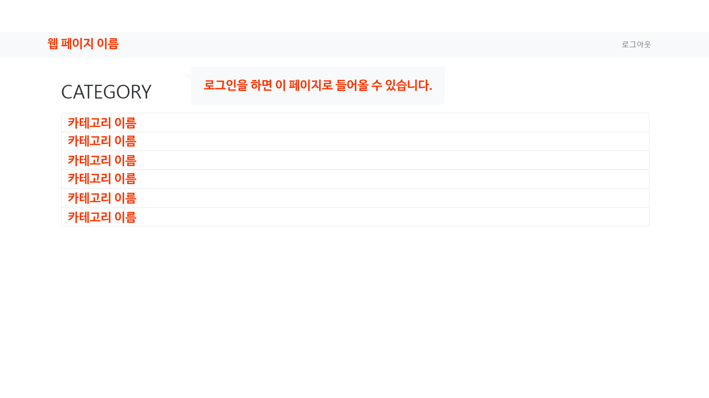
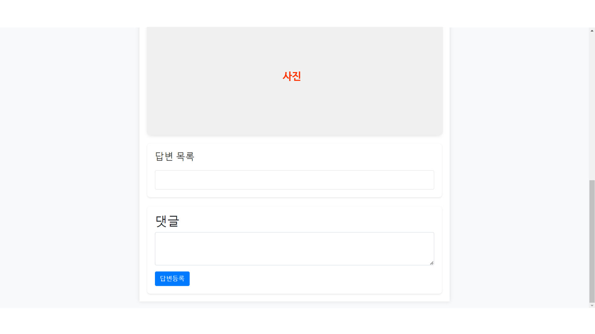

# DA35-5th-합쳐서100살-Data Labeling

# 프로젝트 설명
## 1. 주제 소개
- 이미지에 대한 답변 등록 시스템

## 2. 팀원과 담당업무
- 고서영 : 홈, 로그인 기능, 페이지 레이아웃 구현
- 김인호 : 모델 객체 DB화 기능, 템플릿 구현
- 음정우 : CSS 적용, 회원 가입 기능 구현
- 이상준 : 계정 관리 기능, 답변 기능 구현

## 3. 산출물 파일 링크
- 요구사항 명세서
- 화면 설계서
- 애플리케이션 설계서
  - 데이터베이스 정의서
  - 프로그램파일 목록
- 최종 보고서

# 요구사항 명세서

# 화면 설계서
## 메인 페이지
 

## 회원가입 페이지
 

## 로그인 페이지
 

## 카테고리 페이지
 

## 카테고리 상세 이미지 페이지
 

## 댓글 작성 페이지
 

# 애플리케이션 설계서
## 1. 데이터베이스 정의서
- account 앱
  - 테이블명: account_user
  - 테이블 설명: 고객정보를 관리
  - 컬럼 정보
  
  
- poll 앱
  - 테이블명 - 테이블 설명
  - poll_category - 카테고리 관리
  - poll_image_path - 이미지 관리
  - poll_ans_vote - 댓글 및 좋아요 정보를 관리
  - 컬럼 정보

 
## 2. 프로그램 목록

# 최종 보고서
## 1. 프로젝트의 주제와 선택 이유
- 이번 프로젝트의 주제는 업로드된 이미지를 보고 사용자들이 이미지가 어떤 상품인지에 대한 답변을 달고, 각 답변에 추천이 가능하도록 하는 웹사이트이다. 해당 주제를 선택하게 된 이유는, 이후에 진행하게 될 제품 그룹 자동화 프로젝트에서 활용 가능한 데이터셋을 얻기 위함이다. 웹에서 크롤링한 이미지들은 대개 라벨링이 이루어져 있지 않기 때문에 활용하기가 어려우며 직접 라벨링을 하기에는 시간 소요가 너무 크기 때문에 해당 작업을 다수의 사용자들에게 분산시키자는 아이디어에서 출발했다. 따라서 사용자들이 답변을 생성하고 추천하는 과정을 통해 정확성이 낮은 데이터들은 걸러진 데이터셋을 확보할 수 있도록 하는 웹페이지를 만들어 보기로 했다.

## 2. 진행 과정
- 필요한 기능 설계
  - 사용자 계정 : 회원가입, 로그인, 로그아웃
  - 데이터 베이스 관리 : [카테고리 <- 이미지 <- 답변] 구조
  - 상호작용 : 이미지에 대한 답변 생성, 생성된 답변들에 대한 추천
  
- 실제 구현 과정
  - account 앱 : 사용자 계정을 관리하는 회원가입, 로그인, 로그아웃 기능을 담당
  - poll 앱 : 카테고리, 이미지, 답변 객체를 관리하며 사용자와의 상호작용 기능을 담당
    - 카테고리 : Category 객체를 생성, 카테고리명과 생성 일자 정보를 가짐
    - 이미지 : Image_path 객체를 생성, 해당하는 Category 객체를 상속하며 이미지의 파일명과 경로명 정보를 가짐
    - 답변 : Ans_vote 객체를 생성, 

## 3. 수정 계획
- 
